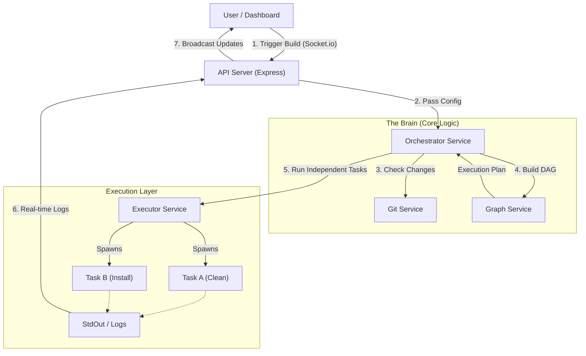

# Build Orchestrator - Automated CI/CD Pipeline System  
*(Major Project - Final Year B.Tech)*  

## 🚀 Project Overview  
This is a **Build Orchestration System** I built to understand how tools like Jenkins or GitHub Actions work under the hood. The core idea is simple: **running tasks one by one is slow**. If "Frontend Build" and "Backend Build" don't depend on each other, they should run at the same time!  

This project takes a list of tasks (with dependencies), builds a **Dependency Graph (DAG)**, and executes independent tasks in **parallel**. It also features a real-time dashboard to monitor the progress.  

## 🎯 Problem Statement  
In standard scripts (like a shell script), commands run sequentially:  
`clean` -> `install` -> `test` -> `build`  

Even if `test` fails, we might want to know if `build` succeeds. Or if `test_frontend` and `test_backend` are separate, they shouldn't block each other.  
**My Solution**: A NodeJS server that parses a JSON config, calculates the optimal execution order, and runs tasks concurrently where possible.  

---  

## ⚙️ How It Works (Methodology)  

### 1. The Core Engine (Node.js)  
I chose **Node.js** because its non-blocking I/O is perfect for handling multiple build processes at once.  

### 💡 System Architecture  
Here is a high-level view of how the system processes a build request:



### 2. Dependency Resolution (The "Brain")  
I implemented a **Directed Acyclic Graph (DAG)** algorithm.  
- **Input**: A list of tasks with `dependencies` arrays.  
- **Logic**:  
    1.  Find all tasks with *zero* pending dependencies.  
    2.  Run them (Layer 1).  
    3.  Once they finish, remove them from the graph and repeat for the next layer.  
This ensures that we never run a task before its prerequisites are met.  

### 3. Real-Time Updates  
Instead of refreshing the page to see if a build finished, I used **Socket.io**. The server "emits" logs and status updates instantly to the connected client.  

### 4. Data Persistence  
- **MongoDB**: Used to store build history and logs permanently.  
- **In-Memory Fallback**: If MongoDB isn't running (e.g., during a demo on a university PC), the system automatically switches to storing data in RAM so the application doesn't crash.  

---  

## 📸 Screenshots  
*(Place your dashboard screenshots here)*  

---  

## 🛠️ Tech Stack  
- **Backend**: Node.js, Express.js (REST API)  
- **Real-time**: Socket.io (WebSockets)  
- **Database**: MongoDB (with Mongoose)  
- **Frontend**: HTML5, Vanilla JS (kept it lightweight for speed)  
- **DevOps Concepts**: Process Management (`child_process`), file handling (`fs-extra`)  

---  

## 🚀 Setup & Installation  

### Prerequisites  
- Node.js installed.  
- MongoDB (optional - system works without it too).  

### Steps  
1. **Clone the Repo**  
   ```bash  
   git clone https://github.com/your-username/build-orchestrator.git  
   cd build-orchestrator  
   ```  

2. **Install Dependencies**  
   ```bash  
   npm install  
   ```  

3. **Run the Server**  
   ```bash  
   npm start  
   ```  
   *Server starts at `http://localhost:3000`*  

4. **Trigger a Test Build**  
   Open the Dashboard in your browser and click **"Trigger Sample Build"**.  

---  

## 🧠 Challenges & Learnings  
**1. Race Conditions & File Locking**  
Initially, if two tasks tried to write to the same log file, the data got messy. I solved this by keeping logs in memory array first and then flushing them to the DB/File in chunks.  

**2. Handling "Zombie" Processes**  
Sometimes a build task would freeze. I learned how to use Node's `child_process` events to detect timeouts and kill hung processes so the server stays healthy.  

**3. The "Diamond Dependency" Problem**  
If Task D depends on B and C, and both B and C depend on A—making sure A runs *only once* was tricky. The DAG layer logic solved this elegantly.  

---  

## ⚠️ Limitations (Honest Analysis)  
- **Security**: Currently, the system runs shell commands directly on the host machine. In a real company implementation, this should run inside **Docker Containers** to prevent malicious code usage.  
- **Scalability**: Since it uses in-memory coordination, it works on one server. If we had 10,000 builds, we'd need a message queue like RabbitMQ (future scope).  

---  

## 🔮 Future Enhancements  
- **Docker Support**: Isolate every build step in a container.  
- **GitHub Webhooks**: Automatically trigger a build when code is pushed.  
- **User Accounts**: Login system for who triggered which build.  

---  

## 📜 Conclusion  
This project represents a bridge between software development and DevOps. It taught me not just how to *write* code, but how code is *built, tested, and delivered*.  
